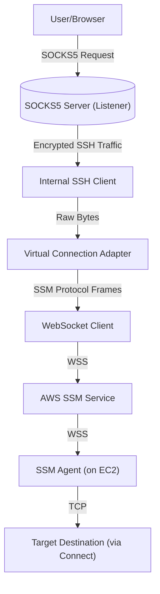
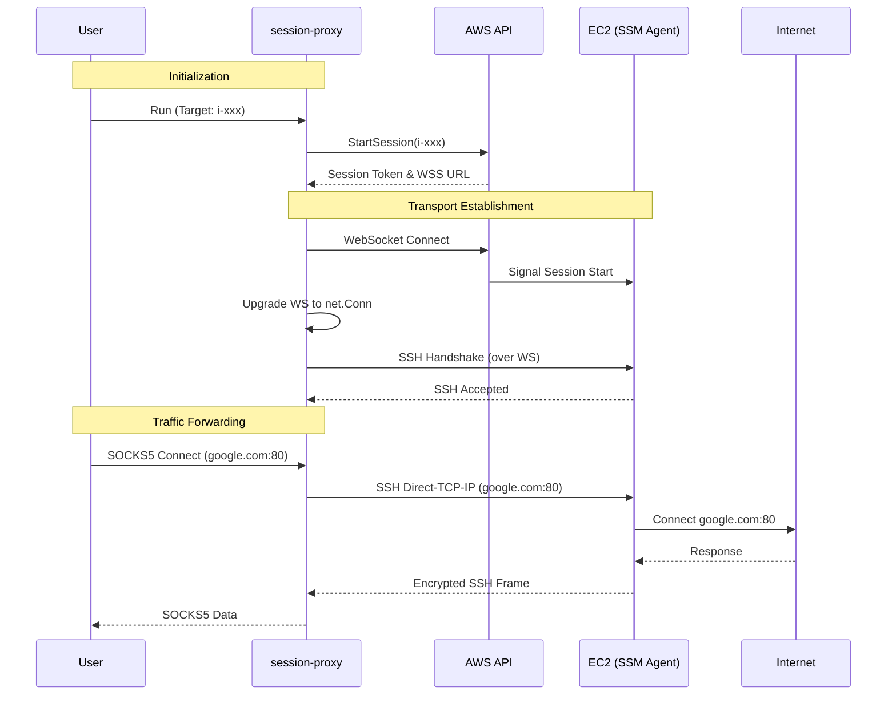

# Architecture Design: Session Proxy

## Overview
`session-proxy` is a unified CLI tool designed to simplify secure connectivity to private AWS EC2 instances. It replaces the complex two-step process of using the AWS CLI `ProxyCommand` with a standard SSH client.

**Core Value Proposition**:
- Single binary deployment (Go).
- Native AWS SSM integration (no external `session-manager-plugin` required).
- Integrated SOCKS5 proxy server.

## High-Level Architecture



## Component Design

### 1. Application Layer (CLI)
Entry point responsible for:
- Parsing command-line arguments (target instance, ports, SSH keys).
- Initializing the AWS SDK v2 configuration.
- Wiring together the components.

### 2. SSM Connector (`internal/aws/ssm`)
Responsible for the specific interaction with AWS APIs.
- **Input**: Instance ID, verify target status.
- **Action**: Call `StartSession` with document `AWS-StartSSHSession`.
- **Output**: Session Token, Stream URL.

### 3. Protocol Adapter (`internal/protocol`)
The core innovation piece. It translates between Go's standard `net.Conn` stream and the message-based AWS SSM Protocol.

**Key responsibilities:**
- **Framing**: Serializing/Deserializing the SSM binary protocol (Payload type, Sequence number, Flags).
- **Buffering**: Handling the difference between stream-based SSH reads and packet-based SSM payloads.
- **Heartbeats**: Maintaining the WebSocket connection.

**Interface:**
```go
type SSMConnection interface {
    net.Conn // Implements Read/Write/Close/LocalAddr/RemoteAddr...
}
```

**Protocol Details**:
The adapter must handle the following payload types:
- `Output_Stream_Data`: Received from AWS (Remote data).
- `Input_Stream_Data`: Sent to AWS (User data).
- `Acknowledge`: Handling flow control if necessary.

### 4. SSH Tunnel (`internal/ssh`)
Wraps the `SSMConnection` with an SSH handshake.
- Uses `golang.org/x/crypto/ssh`.
- Performs authentication (Private Key/Agent).
- Establishes the secure tunnel *inside* the SSM session.

### 5. SOCKS5 Proxy (`internal/proxy`)
Listens on a local port (e.g., 28881) and proxies traffic via the SSH Tunnel.
- Validates SOCKS5 handshake.
- Uses the `SSHClient.Dial` to forward connections, effectively making the EC2 instance the exit node.

## Data Flow Sequence




### 6. Low-Level Protocol Specification

The SSM Agent communication uses a **binary message format** over WebSocket (not JSON headers).

**Message Structure (Total Header = 116 bytes fixed):**
```
Offset  Size  Field
------  ----  -----
0       4     HeaderLength (always 116, BigEndian)
4       32    MessageType (null-padded string: "input_stream_data", "output_stream_data", "acknowledge")
36      4     SchemaVersion (BigEndian, always 1)
40      8     CreatedDate (BigEndian, milliseconds since epoch)
44      8     SequenceNumber (BigEndian, starts at 0)
52      8     Flags (BigEndian, 0=data, 1=SYN, 2=FIN, 3=ACK)
60      16    MessageId (UUID bytes, big-endian)
76      32    PayloadDigest (SHA256 of payload)
108     4     PayloadType (BigEndian)
112     4     PayloadLength (BigEndian)
116     N     Payload (N = PayloadLength bytes)
```

**PayloadType Values:**
| Value | Name | Direction | Description |
|-------|------|-----------|-------------|
| 0 | Output | Agent→Plugin | Shell output data |
| 1 | StdOut | Agent→Plugin | Standard output (Port forwarding) |
| 5 | HandshakeRequest | Agent→Plugin | Session handshake initiation |
| 6 | HandshakeResponse | Plugin→Agent | Handshake acknowledgment |
| 7 | HandshakeComplete | Agent→Plugin | Handshake completion |

**Critical: Sequence Number Handling**
- First message MUST have `SequenceNumber = 0`
- Agent validates `SequenceNumber == ExpectedSequenceNumber` (starts at 0)
- Messages with wrong sequence are silently dropped (ACKed but not processed)

**Acknowledge Payload Format (JSON):**
```json
{
    "AcknowledgedMessageType": "output_stream_data",
    "AcknowledgedMessageId": "uuid-string",
    "AcknowledgedMessageSequenceNumber": 0,
    "IsSequentialMessage": true
}
```

**Handshake Flow:**
1. Agent → Plugin: `HandshakeRequest` (PayloadType=5, Seq=0)
2. Plugin → Agent: ACK + `HandshakeResponse` (PayloadType=6, Seq=0)
3. Agent → Plugin: `HandshakeComplete` (PayloadType=7, Seq=1)
4. Session ready for data transfer

## Security Considerations

1.  **IAM Permissions**:
    The user's AWS credential must have `ssm:StartSession` permission on the target resource.
    
    ```json
    {
        "Effect": "Allow",
        "Action": "ssm:StartSession",
        "Resource": "arn:aws:ec2:region:account:instance/i-xxx",
        "Condition": {
            "StringEquals": {
                "ssm:document/name": "AWS-StartSSHSession"
            }
        }
    }
    ```

2.  **End-to-End Encryption**:
    - **Layer 1 (TLS)**: WebSocket connection to AWS is TLS encrypted.
    - **Layer 2 (SSH)**: The inner tunnel is standard SSH (AES/ChaCha20), ensuring AWS cannot inspect the traffic content, only the metadata.

3.  **Host Key Verification**:
    The SSH client *must* perform host key verification. Since we are connecting via a proxy, standard `known_hosts` checks apply. Users must verify the fingerprint upon first connection.

## Directory Structure Strategy

```text
/
├── cmd/
│   └── session-proxy/    # Main entry point
├── internal/
│   ├── aws/              # AWS SDK interactions (SSM StartSession)
│   ├── protocol/         # SSM <-> net.Conn adapter (Reads/Writes frames)
│   ├── ssh/              # SSH Client wrapper & Dial logic
│   └── proxy/            # SOCKS5 Server implementation
├── pkg/                  # (Optional) Reusable libraries
└── docs/                 # Documentation
```
