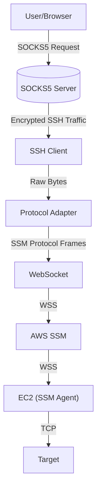
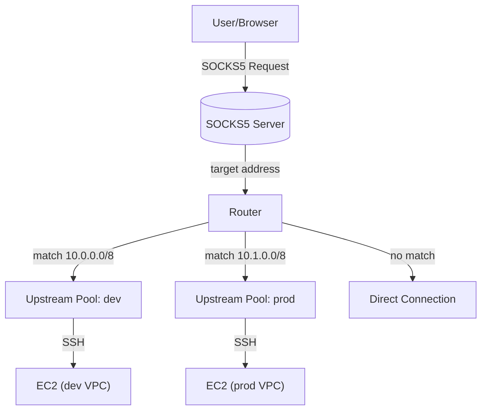
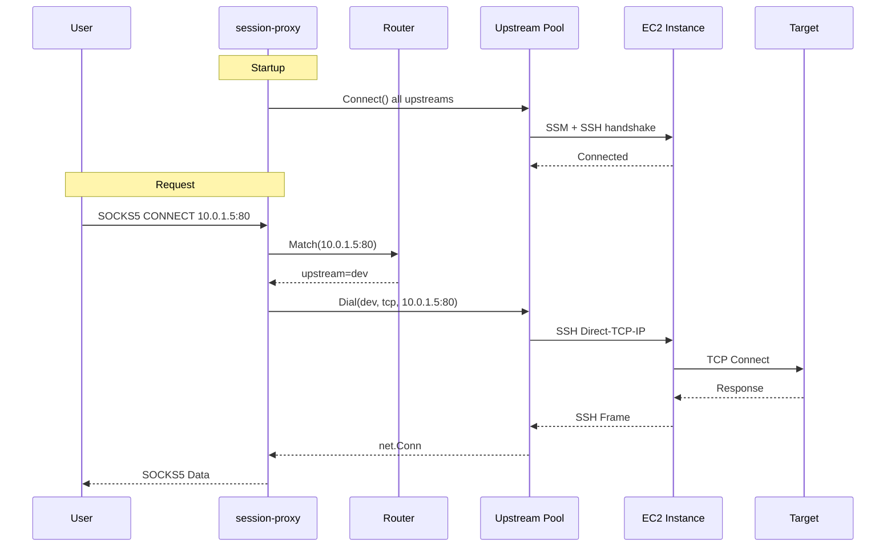

# Architecture Design: Session Proxy

## Overview
`session-proxy` is a unified CLI tool designed to simplify secure connectivity to private AWS EC2 instances. It replaces the complex two-step process of using the AWS CLI `ProxyCommand` with a standard SSH client.

**Core Value Proposition**:
- Single binary deployment (Go).
- Native AWS SSM integration (no external `session-manager-plugin` required).
- Integrated SOCKS5 proxy server.
- **Multi-upstream routing** with automatic failover.
- **Route-based traffic steering** via CIDR and domain patterns.

## High-Level Architecture

### Single Upstream Mode (Legacy)



### Multi-Upstream Mode (Config-Driven)



## Component Design

### 1. Configuration (`internal/config`)
- **Viper-based** config loading (YAML/TOML).
- **Search priority**: CLI flags > `--config` path > `./config.yaml` > `$XDG_CONFIG_HOME/session-proxy/config.yaml`
- Validates AWS profile vs inline credentials.
- SSH credentials per upstream.

### 2. Router (`internal/router`)
Matches destination addresses to upstream names.
- **CIDR matching**: `10.0.0.0/8` → upstream `dev`
- **Domain glob matching**: `*.prod.internal` → upstream `prod`
- Returns default upstream if no match.

### 3. Upstream Pool (`internal/upstream`)
Manages multiple SSM/SSH connections.

**Lifecycle:**
1. **Startup**: `Connect()` establishes all connections (fail → exit).
2. **Runtime**: `maintain()` goroutine monitors and reconnects.
3. **Failover**: On dial failure, tries next instance in list.

```go
type Pool struct {
    groups map[string]*Group  // Keyed by upstream name
}

type Group struct {
    instances []string  // Failover list
    current   int       // Current active instance
    sshClient *ssh.Client
}
```

### 4. SSM Connector (`internal/aws/ssm`)
- **Profile mode**: Region auto-detected from AWS config.
- **Inline mode**: Requires explicit region + access_key + secret_key.

```go
type ClientConfig struct {
    Profile   string  // Use AWS config profile
    Region    string  // Explicit region (for inline creds)
    AccessKey string
    SecretKey string
}
```

### 5. Protocol Adapter (`internal/protocol`)
Translates between `net.Conn` stream and SSM binary protocol.

**Message Structure (116-byte header):**
```
Offset  Size  Field
------  ----  -----
0       4     HeaderLength (116)
4       32    MessageType
44      8     SequenceNumber
60      16    MessageId
108     4     PayloadType
112     4     PayloadLength
116     N     Payload
```

### 6. SSH Tunnel (`internal/ssh`)
- Uses `golang.org/x/crypto/ssh`.
- Supports private key or ssh-agent authentication.
- Credentials configured per upstream.

### 7. SOCKS5 Proxy (`internal/socks5`)
- **RFC 1929 authentication** (optional username/password).
- Uses router to select upstream, then dials via SSH.

## Data Flow Sequence



## Configuration Example

```yaml
listen: "127.0.0.1:28881"

auth:  # Optional SOCKS5 authentication
  user: admin
  pass: secret

upstreams:
  dev:
    ssh:
      user: ec2-user
    aws:
      profile: default  # Region auto-detected
    instances: [i-dev-1, i-dev-2]

  prod:
    ssh:
      user: admin
      key: ~/.ssh/prod.pem
    aws:
      profile: prod
    instances: [i-prod-1]

routes:
  - match: "10.0.0.0/8"
    upstream: dev
  - match: "*.prod.internal"
    upstream: prod

default: dev
```

## Directory Structure

```text
/
├── cmd/
│   └── session-proxy/    # Main entry point
├── internal/
│   ├── aws/ssm/          # AWS SSM client
│   ├── config/           # Configuration loading
│   ├── protocol/         # SSM <-> net.Conn adapter
│   ├── proxy/            # SOCKS5 Server (legacy + routing)
│   ├── router/           # Route matching
│   ├── session/          # Legacy single-upstream manager
│   ├── socks5/           # SOCKS5 protocol implementation
│   ├── ssh/              # SSH client wrapper
│   └── upstream/         # Multi-upstream pool
├── config.example.yaml   # Example configuration
└── docs/                 # Documentation
```

## Security Considerations

1. **IAM Permissions**: Required `ssm:StartSession` on target instances.
2. **End-to-End Encryption**: TLS (WebSocket) + SSH (inner tunnel).
3. **Credential Storage**: 
   - Use AWS profiles (not inline credentials).
   - SSH keys should be protected or use ssh-agent.
4. **SOCKS5 Authentication**: Optional but recommended for shared networks.
